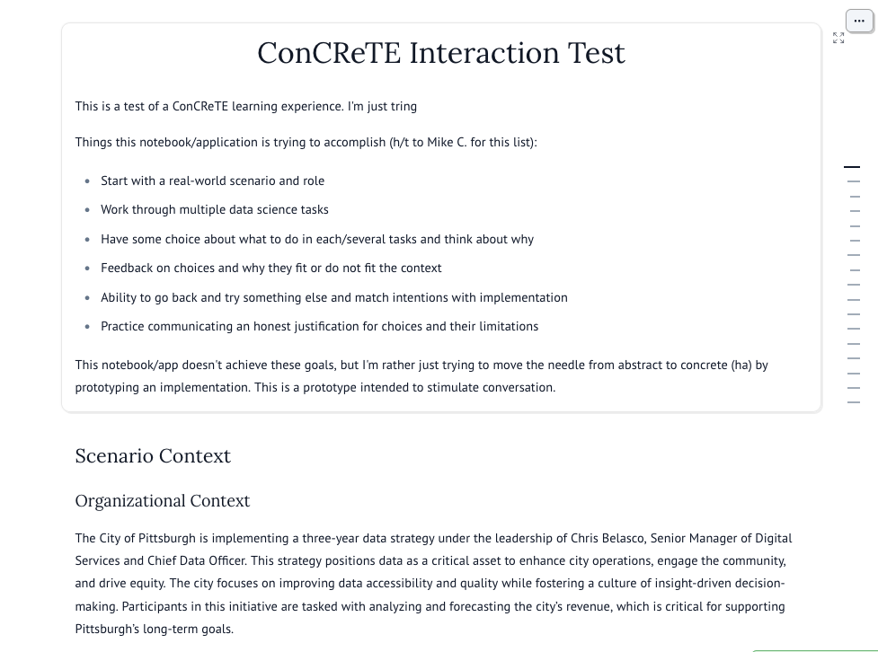

# ConCReTE Model Building

This is a [Marimo Notebook](http://marimo.io) that prototypes an interactive ConCReTE experience.

The fastest way to experience this notebook is to visit the WASM version of the notebook at the link below:

https://rce.pitt.edu/concrete/

Note, it will take a few seconds to load the notebook because its loading everything in your web browser (look ma, no cloud required!). At first you will see a bunch of code blocks, but once it has finished you should see:

## Running on your local machine

This uses `uv` to manage the development environment.

You need to have `uv` installed to run this notebook. IF you don't have it installed, follow the [instructions online](https://docs.astral.sh/uv/)

## Launch the Notebook in Run mode

Marimo notebooks can be launched in "run" mode, which allows you to interact with the notebook as an application.

To start the notebook in "run" mode, which make  `uv run marimo run concrete-model-building.py` to launch the Marimo notebook.

## Launch the Notebook in Edit mode

Launching the notebook in edit mode will open the Marimo notebook editor.

`uv run marimo edit concrete-model-building.py`

## Publishing to WASM

**Publish in run mode** to the `publish` directory:

`uv run marimo export html-wasm concrete-model-building.py -o publish --mode run --show-code`

**Publish in edit mode** to the `publish-edit` directory:

`uv run marimo export html-wasm concrete-model-building.py -o publish-edit --mode edit --show-code`
